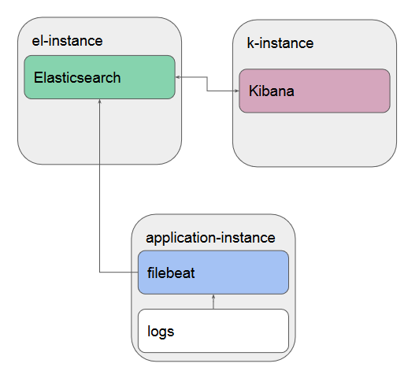

# netology-83

## Что делает playbook

Плейбук развернёт три приложения на разных хостах:

- Elasticsearch
- Kibana
- Filebeat

Схема свяхи между приложениями:

## Какие у него есть теги

- elastic
- kibana
- filebeat

## Какие у него есть параметры

- IP хостов нужно задать в файле инвентаризации [hosts.yml](inventory/prod/hosts.yml)
- Версию приложений можно задать в [all.yml](inventory/prod/group_vars/all.yml), она одинаковая для всего стека.
- Желательно задать объём памяти для JVM, для этого поправьте переменную `ES_JAVA_OPTS` в шаблоне [elasticsearch_sysconfig.j2](templates/elasticsearch_sysconfig.j2)
  
  Иначе Эластик может быть убит oom-киллером. Подробней о настройках можно прочитать по [ссылке](https://stackoverflow.com/questions/14763079/what-are-the-xms-and-xmx-parameters-when-starting-jvm).
  
- Все приложения будут установлены из RPM-пакетов.
